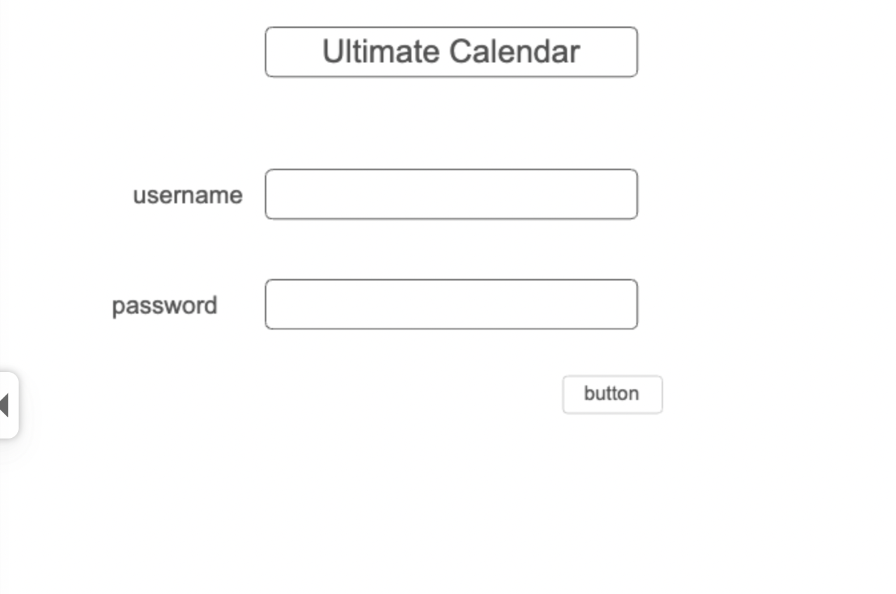
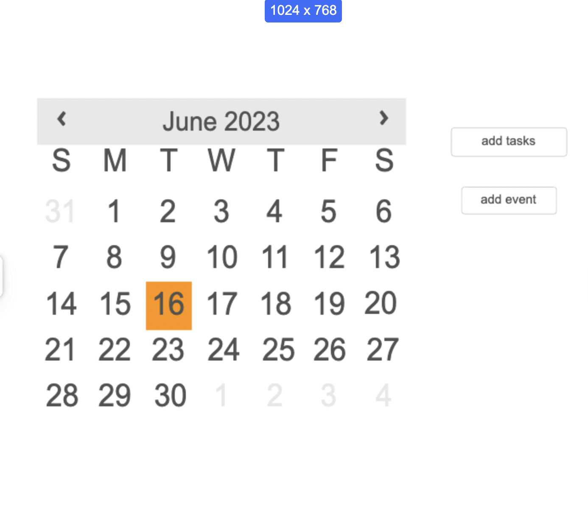
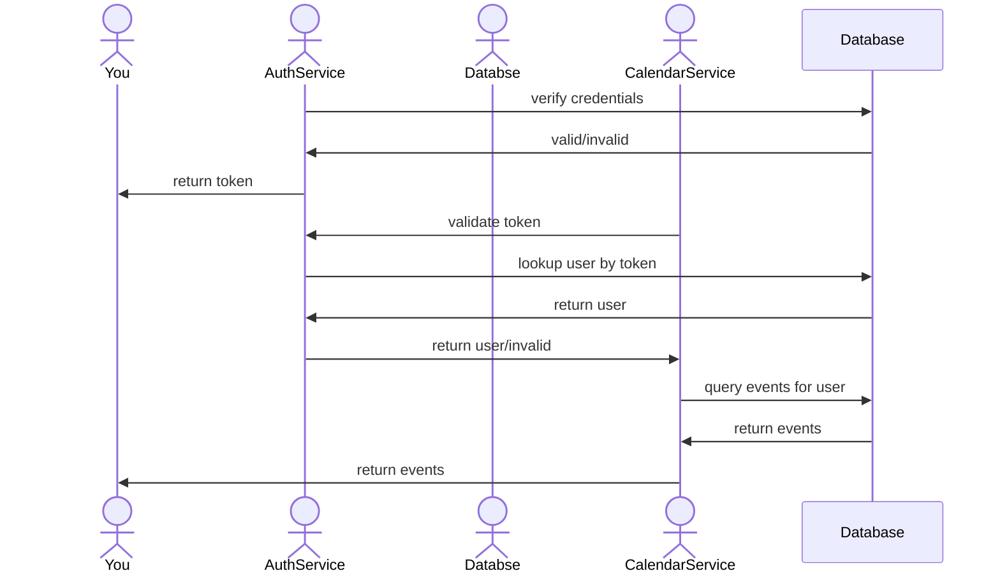

# Ultimate Calendar

[My Notes](notes.md)

A brief description of the application here. Lorem ipsum dolor sit amet, consectetur adipiscing elit, sed do eiusmod tempor incididunt ut labore et dolore magna aliqua. Ut enim ad minim veniam, quis nostrud exercitation ullamco laboris nisi ut aliquip ex ea commodo consequat. Duis aute irure dolor in reprehenderit in voluptate velit esse cillum dolore eu fugiat nulla pariatur. Excepteur sint occaecat cupidatat non proident, sunt in culpa qui officia deserunt mollit anim id est laborum.

> [!NOTE]
>  This is a template for your startup application. You must modify this `README.md` file for each phase of your development. You only need to fill in the section for each deliverable when that deliverable is submitted in Canvas. Without completing the section for a deliverable, the TA will not know what to look for when grading your submission. Feel free to add additional information to each deliverable description, but make sure you at least have the list of rubric items and a description of what you did for each item.

> [!NOTE]
>  If you are not familiar with Markdown then you should review the [documentation](https://docs.github.com/en/get-started/writing-on-github/getting-started-with-writing-and-formatting-on-github/basic-writing-and-formatting-syntax) before continuing.

## 🚀 Specification Deliverable

> [!NOTE]
>  Fill in this sections as the submission artifact for this deliverable. You can refer to this [example](https://github.com/webprogramming260/startup-example/blob/main/README.md) for inspiration.

For this deliverable I did the following. I checked the box `[x]` and added a description for things I completed.

- [ ] Proper use of Markdown
- [ ] A concise and compelling elevator pitch
- [ ] Description of key features
- [ ] Description of how you will use each technology
- [ ] One or more rough sketches of your application. Images must be embedded in this file using Markdown image references.

### Elevator pitch

Did you ever need to look at five different apps and websites to know what to do in a day? Or needed a place where you can easily see and organize your entire schedule? The Ultimate Calendar is your only calendar app you need, it will allow for individual specialization to fit each person needs. There are options to create tasks that needed to be done and events that are happening as well as creating ways to schedule hobbies and habits, perfect for those wanting to plan their day to the minute or for those who need to remember specific events. 

### Design

This is the sequence diagram for logging into the calendar, that authentication process and the retrieving the calendar

### Key features

- secure login over https
- ability to have multiple users
- personalize features(ie colors and fonts)
- connect calendars from different platforms
- adds tasks and events of different categories(that can be customized)
- ability to add reoccuring events and tasks
- customize event description for events
- details are stored accurately
- remind about events and tasks
- having shared events
  
### Technologies

I am going to use the required technologies in the following ways.

- **HTML** - The structral layout of the calendar. There will be about two pages(maybe more adding and customizing) one for login and the other for calendar view. 
- **CSS** - The styling aspect of the calendar so it can fit differnet screens. It controls the colors and font of the application(a user can customize this)
- **React** - provides login and register new users, dispaly calendar, creating a task list, adding events, also settings for personalizing themse and fonts. It also switches the view for login to the calendar. 
- **Service** - Endpoints
  - register and login
  - retreve user events
  - add new event tasks
  - update events
  - delte events
  - get and set preferences
  - Third party: using other calendar API(like for holidays also maybe google calendar)
- **DB/Login** - Stores all data such as user data, event data, task data, preference data. ensures each user only sees their own data.
- **WebSocket** - handles event and task updates(such as pushing reminders and updating events if changed from other users)

## 🚀 AWS deliverable

For this deliverable I did the following. I checked the box `[x]` and added a description for things I completed.

- [ ] **Server deployed and accessible with custom domain name** - [My server link](https://yourdomainnamehere.click).

## 🚀 HTML deliverable

For this deliverable I did the following. I checked the box `[x]` and added a description for things I completed.

- [x] **HTML pages** - There are 4 html pages one for the login screen, the other for the main calendar. There is one html to disply the event information and another when adding an event
- [x] **Proper HTML element usage** - There is proper html usuage in the all the html. Especially in the calendar where I formatted the title as well as the body. In the body formatted to resemble a calendar format.
- [x] **Links** - There are multiple links throughout the html there is a link from login to the calendar, the calendar to the event form and a link to the event page.
- [x] **Text** - There is multiple texts throughout the html, describing the features in the website
- [x] **3rd party API placeholder** - The 3rd party api I am going to use is going to be a public holidays so its going to be in like the example event.
- [x] **Images** - I don't know if this counts as images but I put emojis in front of some the inputed data such as the date and description headings for the event html
- [x] **Login placeholder** - In the index.html there is place to login and enter username and password
- [x] **DB data placeholder** - There is an example event put in the calendar as a placeholder of the information that will be stored in a database
- [] **WebSocket placeholder** - I couldn't figure out where I could put a placeholder for the reminders. 

## 🚀 CSS deliverable

For this deliverable I did the following. I checked the box `[x]` and added a description for things I completed.

- [ ] **Header, footer, and main content body** - I did not complete this part of the deliverable.
- [ ] **Navigation elements** - I did not complete this part of the deliverable.
- [ ] **Responsive to window resizing** - I did not complete this part of the deliverable.
- [ ] **Application elements** - I did not complete this part of the deliverable.
- [ ] **Application text content** - I did not complete this part of the deliverable.
- [ ] **Application images** - I did not complete this part of the deliverable.

## 🚀 React part 1: Routing deliverable

For this deliverable I did the following. I checked the box `[x]` and added a description for things I completed.

- [ ] **Bundled using Vite** - I did not complete this part of the deliverable.
- [ ] **Components** - I did not complete this part of the deliverable.
- [ ] **Router** - I did not complete this part of the deliverable.

## 🚀 React part 2: Reactivity deliverable

For this deliverable I did the following. I checked the box `[x]` and added a description for things I completed.

- [ ] **All functionality implemented or mocked out** - I did not complete this part of the deliverable.
- [ ] **Hooks** - I did not complete this part of the deliverable.

## 🚀 Service deliverable

For this deliverable I did the following. I checked the box `[x]` and added a description for things I completed.

- [ ] **Node.js/Express HTTP service** - I did not complete this part of the deliverable.
- [ ] **Static middleware for frontend** - I did not complete this part of the deliverable.
- [ ] **Calls to third party endpoints** - I did not complete this part of the deliverable.
- [ ] **Backend service endpoints** - I did not complete this part of the deliverable.
- [ ] **Frontend calls service endpoints** - I did not complete this part of the deliverable.
- [ ] **Supports registration, login, logout, and restricted endpoint** - I did not complete this part of the deliverable.

## 🚀 DB deliverable

For this deliverable I did the following. I checked the box `[x]` and added a description for things I completed.

- [ ] **Stores data in MongoDB** - I did not complete this part of the deliverable.
- [ ] **Stores credentials in MongoDB** - I did not complete this part of the deliverable.

## 🚀 WebSocket deliverable

For this deliverable I did the following. I checked the box `[x]` and added a description for things I completed.

- [ ] **Backend listens for WebSocket connection** - I did not complete this part of the deliverable.
- [ ] **Frontend makes WebSocket connection** - I did not complete this part of the deliverable.
- [ ] **Data sent over WebSocket connection** - I did not complete this part of the deliverable.
- [ ] **WebSocket data displayed** - I did not complete this part of the deliverable.
- [ ] **Application is fully functional** - I did not complete this part of the deliverable.
